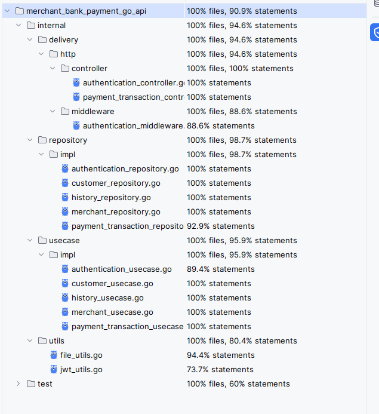

# Merchant Bank Payment API - Golang Implementation

## Project Description
Creating simple API for login, logout, and doing payment. This project also included security(JWT) and logging. 

## Requirement
- Go version 1.22.2 or higher

## Technologies Used

- **Gin** - Web framework
- **GodotEnv** - Load env
- **Validator** - Input validation
- **Bcrypt** - Password hashing
- **Golang JWT** - JSON Web Tokens for authentication
- **UUID** - Unique identifier generation
- **Testify** - Testing framework
- **Logrus** - Logging purpose

## Project Structure
```
    merchant_bank_payment_go_api/
    │
    ├── cmd/
    │   └── app/
    │       └── main.go
    │
    ├── internal/
    │   ├── config/
    │   │   ├── app.go
    │   │   ├── config.go
    │   │   └── logrus.go
    │   │
    │   ├── delivery/
    │   │   └── http/
    │   │       ├── controller/
    │   │       │   ├── authentication_controller.go
    │   │       │   └── payment_transaction_controller.go 
    │   │       ├── middleware/
    │   │       │   └── authentication_middleware.go
    │   │       └── route/                           
    │   │           └── router.go
    │   │
    │   ├── entity/
    │   │   ├── customer.go
    │   │   ├── history.go 
    │   │   ├── merchant.go
    │   │   └── payment.go
    │   │
    │   ├── model/
    │   │   ├── common_response.go
    │   │   ├── customer_model.go 
    │   │   └── payment_model.go
    │   │
    │   ├── repository/
    │   │   ├── data/
    │   │   │   ├── BlacklistToken.json
    │   │   │   ├── Customer.json
    │   │   │   ├── History.json
    │   │   │   ├── Merchant.json
    │   │   │   └── PaymentTransactions.json
    │   │   ├── impl/
    │   │   │   ├── authentication_repository.go
    │   │   │   ├── customer_repository.go
    │   │   │   ├── history_repository.go 
    │   │   │   ├── merchant_repository.go 
    │   │   │   └── payment_transaction_repository.go 
    │   │   ├── authentication_repository.go
    │   │   ├── customer_repository.go 
    │   │   ├── history_repository.go 
    │   │   ├── merchant_repository.go 
    │   │   └── payment_transaction_repository.go 
    │   │
    │   ├── usecase/
    │   │   ├── impl/
    │   │   │   ├── authentication_usecase.go
    │   │   │   ├── customer_usecase.go
    │   │   │   ├── history_usecase.go
    │   │   │   ├── merchant_usecase.go
    │   │   │   └── payment_transaction_usecase.go
    │   │   ├── authentication_usecase.go
    │   │   ├── customer_usecase.go
    │   │   ├── history_usecase.go
    │   │   ├── merchant_usecase.go
    │   │   └── payment_transaction_usecase.go
    │   │
    │   └── utils/
    │       └── file_utils.go
    │       └── jwt_utils.go
    ├── tests/
    ├── .env
    └── Dockerfile
```
## How to run
1. Clone the repository
```
git clone https://github.com/GtFoBAE05/merchant_bank_payment_go_api.git
```
2. Build Docker Image
```
docker build -t merchant_bank_payment_go_api .
```
3. Run Docker Container
```
docker run -p 8000:8000 -e SECRET_KEY=supersecretkey -e EXPIRE_IN_MINUTES=10 -e PORT=8000 merchant_bank_payment_go_api
```

## API Endpoints

1. Login
   - Method: Post
   - Endpoint: /api/auth/login
   - Request Body
    ```json
    {
      "username": "budi",
      "password": "password"
    }
    ```
   - Response
     - Success
        ```json
        {
            "httpStatus": 200,
            "message": "Successfully logged in",
            "data": {
                  "accessToken": "jwt"
            }
        }
         ```
     - Invalid Credentials
        ```json
        {
            "httpStatus": 401,
            "message": "invalid credentials",
            "data": null
        }
         ```
2. Logout
   - Method: Post
   - Endpoint: /api/auth/logout
   - Authorization: Bearer JWT Token
   - Request Header: 
     ```json
       Authorization: Bearer <JWT TOKEN>
     ```
   - Response
       - Success
          ```json
          {
              "httpStatus": 200,
              "message": "Successfully logged out",
              "data": null
          }
           ```
       - No Header
          ```json
          {
              "httpStatus": 401,
              "message": "Authorization Header is required",
              "data": null
          }
           ```
       - JWT Token already blacklisted(already logout but trying logout again)
          ```json
          {
              "httpStatus": 403,
              "message": "Token is already blacklisted",
              "data": null
          }
           ```
3. Payment
   - Method: Post
   - Endpoint: /api/Payment
   - Authorization: Bearer JWT Token
   - Request Header:
     ```json
       Authorization: Bearer <JWT TOKEN>
     ```
   - Request Body:
     ```json
          {
              "merchantId": "66e02583-71d2-4ae2-9d74-d5d9f9b9d618",
              "amount": 15000
          }
     ```
   - Response
       - Success
          ```json
          {
              "httpStatus": 200,
              "message": "Successfully added payment",
              "data": null
          }
           ```
       - Invalid amount(less or equal zero)
          ```json
          {
              "httpStatus": 400,
              "message": "Invalid Body Request",
              "data": null
          }
           ```
       - No Header
          ```json
          {
              "httpStatus": 401,
              "message": "Authorization Header is required",
              "data": null
          }
           ```
       - JWT already used for logout
         ```json
         {
             "httpStatus": 403,
             "message": "Token is already blacklisted",
             "data": null
         }
          ```
       

## Test Coverage


## Note
sample env also included with:
- SECRET_KEY: A secret key used for JWT signing.
- EXPIRE_IN_MINUTES: The expiration time for the JWT token in minutes.
- PORT: The port on which the API will run.

## For development or testing purposes, this is sample data
- Customer:
  - Customer 1
    - id: 685729de-cd87-4524-80bc-9b19cf58df22
    - username: budi
    - password: password
  - Customer 2
    - id: 685729de-cd87-4524-80bc-9b19cf58df44
    - username: susi
    - password: password
  - Customer 3
    - id: 685729de-cd87-4524-80bc-9b19cf58df66
    - username: andi
    - password: password
- Merchant:
  - Merchant 1
    - id: 66e02583-71d2-4ae2-9d74-d5d9f9b9d618
    - name: toko harapan
  - Merchant 2
    - id: 685729de-cd87-4524-80bc-9b19cf58d619
    - name: foodi fud
  - Merchant 3
    - id: 685729de-cd87-4524-80bc-9b19cf58d719
    - name: toko bangunan
